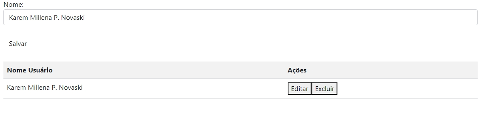

# SISTEMA DE CADASTRO DE USUÁRIOS

* [Sistema de Cadastro de Usuários](#sistema-de-cadastro-de-usuários)
* [Descrição](#descrição)
* [Introdução](#introdução)
* [Funcionalidades](#funcionalidades)
* [Tecnologias Utilizadas](#tecnologias-utilizadas)
* [Autores](#autores)

## DESCRIÇÃO 
Esse código JavaScript é uma implementação para gerenciar uma lista de nomes de usuários, com funcionalidades para adicionar, editar e excluir nomes.

## INTRODUÇÃO
Este código ele oferece funcionalidades básicas para a adição, edição e exclusão de nomes, permitindo que o usuário interaja de maneira intuitiva com a interface. O sistema é dividido em várias funções que trabalham em conjunto para proporcionar uma experiência de gerenciamento de dados eficiente e direta.Este sistema foi desenvolvido para ser simples e eficaz, ideal para aplicações onde a gestão básica de uma lista de usuários é necessária. A interface permite uma manipulação direta dos dados, com feedback imediato para as ações do usuário.

## FUNCIONALIDADES
O código fornecido tem como objetivo principal gerenciar uma lista de nomes de usuários em uma aplicação web.
Essas funcionalidades permitem que o usuário adicione, edite e exclua nomes de uma lista, proporcionando uma interface simples para o gerenciamento de dados.

## VALIDAÇÃO

javascript
function acessar(){
     let loginEmail = document.getElementById('loginEmail').value;
     let loginSenha = document.getElementById('loginSenha').value;
     
     if(!loginEmail || !loginSenha){
       alert('favor preencher todos os campos');
    } else {
       window.location.href = 'cadastro.html';
     }
}

A função acessar é responsável por validar se os campos de email e senha foram preenchidos em um formulário. Se algum desses campos estiver vazio, exibe um alerta para o usuário preencher todos os campos. Se ambos os campos estiverem preenchidos, redireciona o usuário para a página cadastro.html. Essa funcionalidade é útil para garantir que o usuário forneça as informações necessárias antes de prosseguir.

var dadosLista = [];
function salvarUser(){
    let nomeUser = document.getElementById('nomeUser').value;
    if(nomeUser){
        dadosLista.push(nomeUser);
        // console.log(dadosLista);
        criaLista();
        document.getElementById('nomeUser').value = "";
    } else{
        alert("Favor, informar um nome para cadastro");
    }
}

A função salvarUser é responsável por adicionar um nome à lista dadosLista e atualizar a interface do usuário com a nova entrada. Ela verifica se o campo de entrada não está vazio antes de adicionar o nome à lista. Se o campo estiver vazio, exibe uma mensagem de alerta solicitando que o usuário informe um nome. Após adicionar o nome e atualizar a interface, o campo de entrada é limpo para permitir uma nova entrada.

javascript
function criaLista(){
  let tabela = document.getElementById('tabela').innerHTML = "<tr><th>Nome Usuário</th><th>Ações</th></tr>";
  for(let i=0; i<=(dadosLista.length - 1); i++){
      tabela += "<tr><td>" + dadosLista[i] + "</td><td><button type='button' onclick='editar(parentNode.parentNode.rowIndex)'>Editar</button><button type='button' onclick='excluir(parentNode.parentNode.rowIndex)'>Excluir</button></td></tr>";
      document.getElementById('tabela').innerHTML = tabela;
  }
}
 
 Essa funcionalidade gera uma tabela com os nomes dos usuários armazenados.
 
function excluir(i){
    dadosLista.splice((i - 1), 1);
    document.getElementById('tabela').deleteRow(i);

}

A função excluir é projetada para remover um nome da lista dadosLista e a linha correspondente da tabela HTML com base no índice fornecido. A função ajusta o índice para garantir que o item correto seja removido do array e da tabela. É importante garantir que o índice fornecido para deleteRow esteja corretamente sincronizado com o índice usado para manipular dadosLista para evitar inconsistências.

function editar(i){
    document.getElementById("nomeUser").value = dadosLista[(i - 1)];
    dadosLista.splice(dadosLista[(i - 1)])
}

A função editar tem a finalidade de preencher um campo de entrada com o nome que está na lista para permitir a edição desse nome. Após preencher o campo, a função deveria remover o nome da lista para evitar duplicações, mas a implementação original está incorreta. A correção envolve ajustar a chamada ao splice() para usar o índice correto da lista.

## MUDANÇAS
Mudei os codigos do javascript,alterei o cadastro adicionando a função de Email

## TECNOLOGIAS UTILIZADAS
- Visual Studio Code
- HTML5
- CSS3
- JavaScript
- Git
- GitHub
 
## AUTORES
- [Karen Novaski](https://github.com/karenovaski?tab=repositories)

# Resultado

